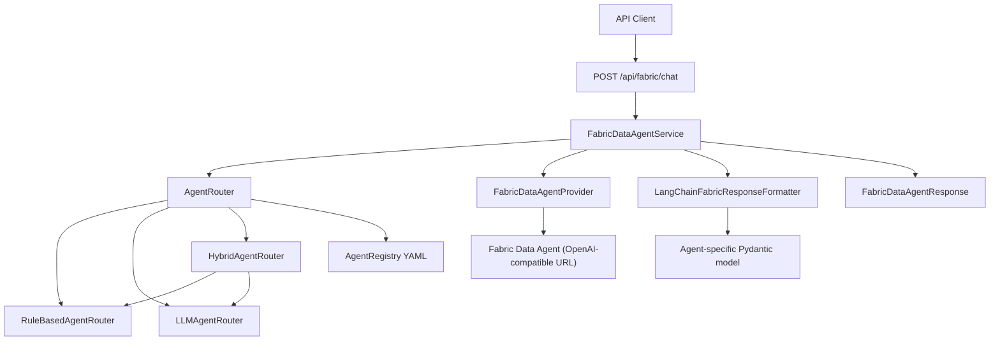

# Fabric Data Agent Flow

This document explains how the FastAPI service receives a request, routes it to the correct Microsoft Fabric Data Agent, calls Fabric, and returns structured Pydantic output.

---

## 1. Overview

| Item | Value |
|------|--------|
| **Endpoint** | `POST /api/fabric/chat` |
| **Config file** | `config/agent_registry.yaml` |
| **Auth to Fabric** | Entra ID — Managed Identity (Azure) or `az login` (local) |
| **Fabric API pattern** | OpenAI Assistants API (Microsoft Fabric Data Agent client pattern) |
| **Structured output** | Per-agent Pydantic models extending `FabricAgentResponseBase` |

The Fabric integration is separate from the Foundry agent flow (`POST /api/chat`). Both can run in the same application.

---

## 2. High-level architecture



---

## 3. Request and response

### Request body

```json
{
  "message": "What were total sales last quarter?",
  "prompt_id": "sales-q1-report",
  "thread_name": null
}
```

| Field | Required | Purpose |
|-------|----------|---------|
| `message` | Yes | The question sent to the Fabric Data Agent |
| `prompt_id` | No | Registered prompt ID for **rule-based** routing (`prompts` section in YAML) |
| `thread_name` | No | Conversation thread name — only used when `prompt_id` is **not** set |

> **Thread behavior**
> - If `prompt_id` is provided → a **new Fabric thread** is always created (`thread_name` is ignored).
> - If `prompt_id` is absent → `thread_name` can reuse a conversation on the same agent.
> - **Not implemented yet:** `thread_id` on the request for query continuation without `prompt_id`.

### Response body

```json
{
  "reply": "Total revenue for Q1 2025 was $1.2M...",
  "agent_id": "sales-agent",
  "response_class": "SalesAgentResponse",
  "routing_method": "rule",
  "data": {
    "answer": "Total revenue for Q1 2025 was $1.2M",
    "total_revenue": 1200000.0,
    "quarter": "Q1 2025",
    "currency": "USD"
  },
  "prompt_id": "sales-q1-report",
  "thread_name": null
}
```

| Field | Meaning |
|-------|---------|
| `reply` | Raw text returned by Fabric |
| `agent_id` | Which agent answered |
| `response_class` | Pydantic model used for `data` |
| `routing_method` | `rule` or `llm` |
| `data` | Validated structured output |

---

## 4. Step-by-step execution flow

### Step 1 — API receives the request

**File:** `src/routers/fabric_data_agent.py`

1. Optional `X-API-Key` header is validated (`verify_api_key`).
2. Body is parsed into `FabricDataAgentRequest`.
3. `FabricDataAgentService.ask()` is called with `message`, `prompt_id`, and `thread_name`.

---

### Step 2 — Agent routing

**Files:** `src/routing/factory.py`, `src/routing/rule_router.py`, `src/routing/llm_router.py`, `src/routing/hybrid_router.py`

The router picks which Fabric agent to call. Mode is set in `config/agent_registry.yaml` under `routing.mode` (or overridden by `FABRIC_ROUTING_MODE`).

| Mode | Behavior |
|------|----------|
| **`rule`** | Look up `prompt_id` in `prompts` → get `agent_id` |
| **`llm`** | LangChain reads `message` + agent descriptions → picks `agent_id` |
| **`hybrid`** | Try `rule` first; if no match, fall back to `llm` |

**Rule example**

```yaml
prompts:
  sales-q1-report:
    agent_id: sales-agent
```

Request with `"prompt_id": "sales-q1-report"` → routes to `sales-agent`.

**LLM example**

The router sends agent descriptions to an Azure OpenAI model (configured via `ROUTING_LLM_ENDPOINT` and `ROUTING_LLM_DEPLOYMENT`). The model returns only the `agent_id` string.

Output of this step: `RoutingDecision(agent_id="sales-agent", method="rule")`.

---

### Step 3 — Load agent configuration

**File:** `src/routing/registry.py`

`AgentRegistry.get_agent(agent_id)` returns:

| Property | Source in YAML |
|----------|----------------|
| `id` | Agent key (e.g. `sales-agent`) |
| `url` | `agents.<id>.url` — published Fabric OpenAI-compatible endpoint |
| `description` | Used by LLM routing |
| `response_class` | Pydantic model for structured `data` |

---

### Step 4 — Resolve Fabric thread

**File:** `src/services/fabric_data_agent_service.py` → `resolve_thread_scope()`

| Condition | Thread passed to Fabric |
|-----------|-------------------------|
| `prompt_id` is set | `None` → Fabric creates a **new** thread |
| No `prompt_id`, `thread_name` set | `{agent_id}:{thread_name}` |
| Neither | `None` → new thread |

---

### Step 5 — Authenticate to Fabric

**File:** `src/services/fabric_data_agent_provider.py`

1. Obtain Entra ID token with scope `https://api.fabric.microsoft.com/.default`.
2. **Local:** `DefaultAzureCredential` (`az login`).
3. **Azure Web App:** `ManagedIdentityCredential`.
4. Token is refreshed automatically before expiry.

---

### Step 6 — Call the Fabric Data Agent

**Files:** `src/services/fabric_data_agent_provider.py`, `src/services/fabric_data_agent_service.py`

This follows the [Microsoft Fabric Data Agent external client](https://github.com/microsoft/fabric_data_agent_client) pattern:

1. Create an `AsyncOpenAI` client pointed at the agent `url`.
2. Create a temporary assistant (`model="not used"`).
3. Get or create a Fabric thread via the Fabric thread API (`/threads/fabric?tag="..."`).
4. Post the user `message` to the thread.
5. Start a run and poll until `status == "completed"` (or timeout).
6. List messages and extract the assistant reply text.
7. Delete the thread after the response.

Timeout is controlled by `FABRIC_QUERY_TIMEOUT` (default `120` seconds).

---

### Step 7 — Format structured response

**File:** `src/services/fabric_response_formatter.py`

The raw Fabric `reply` is converted into the agent's Pydantic `response_class`:

1. **JSON fast-path** — if the reply is JSON (or inside a ` ```json ` block), validate directly with the model.
2. **LLM fallback** — if not JSON and routing LLM is configured, LangChain `with_structured_output(response_class)` extracts fields.
3. **Minimal fallback** — if no LLM is configured, return `{ "answer": "<raw reply>" }` plus model defaults.

---

### Step 8 — Return API response

**File:** `src/services/fabric_data_agent_service.py`

Build `FabricDataAgentResponse` with:

- `reply` — raw Fabric text
- `data` — `structured.model_dump()`
- `agent_id`, `response_class`, `routing_method`, `prompt_id`, `thread_name`

Errors from Fabric are returned as **502 Bad Gateway** with a `detail` message.

---

## 5. Startup lifecycle

**File:** `src/main.py`

On application start (when `config/agent_registry.yaml` exists or `FABRIC_DATA_AGENT_URL` is set):

1. Load `AgentRegistry` from YAML/JSON.
2. Build `AgentRouter` from `routing.mode`.
3. Initialize `FabricDataAgentProvider` (credential only).
4. Create `LangChainFabricResponseFormatter`.
5. Register `/api/fabric/chat` route.

`GET /health` reports `fabric_data_agent_ready`, `fabric_routing_mode`, and `fabric_agent_count`.

---

## 6. Configuration reference

### Environment variables

| Variable | Purpose |
|----------|---------|
| `AGENT_REGISTRY_PATH` | Path to registry file (default: `config/agent_registry.yaml`) |
| `FABRIC_ROUTING_MODE` | Override YAML routing mode: `rule`, `llm`, `hybrid` |
| `FABRIC_QUERY_TIMEOUT` | Max seconds to wait for Fabric (default: `120`) |
| `ROUTING_LLM_ENDPOINT` | Azure OpenAI endpoint — required for `llm` / `hybrid` |
| `ROUTING_LLM_DEPLOYMENT` | Deployment name for routing/formatting LLM |
| `ROUTING_LLM_API_VERSION` | API version (default: `2024-10-21`) |
| `FABRIC_DATA_AGENT_URL` | Legacy single-agent fallback if registry file is missing |

### Registry file structure

```yaml
routing:
  mode: rule  # rule | llm | hybrid

agents:
  <agent_id>:
    url: <published Fabric Data Agent OpenAI URL>
    description: <text for LLM routing>
    response_class: <Pydantic model name>

prompts:
  <prompt_id>:
    agent_id: <agent_id>
```

---

## 7. Pydantic response models

### Base model

**File:** `src/schemas/fabric/base.py`

```python
class FabricAgentResponseBase(BaseModel):
    answer: str  # required on every agent response
```

### Agent-specific models

Each agent extends the base with its own fields:

| Model | File | Extra fields |
|-------|------|--------------|
| `SalesAgentResponse` | `src/schemas/fabric/sales.py` | `total_revenue`, `quarter`, `currency` |
| `InventoryAgentResponse` | `src/schemas/fabric/inventory.py` | `sku_count`, `warehouse`, `stock_status` |

The `response_class` in YAML must match a registered name in `src/schemas/fabric/loader.py` → `RESPONSE_MODELS`, or a full dotted import path.

---

## 8. How to add a new Fabric Data Agent

Use this checklist when onboarding a new agent (example: `finance-agent`).

### Step A — Publish the Fabric Data Agent

1. Create and publish the Data Agent in Microsoft Fabric.
2. Copy the **published OpenAI-compatible URL** (ends with `/aiassistant/openai` or similar).

### Step B — Create a Pydantic response model

1. Create `src/schemas/fabric/finance.py`:

```python
from pydantic import Field
from src.schemas.fabric.base import FabricAgentResponseBase


class FinanceAgentResponse(FabricAgentResponseBase):
    budget_variance: float | None = Field(default=None)
    fiscal_year: str | None = Field(default=None)
```

2. Register the short name in `src/schemas/fabric/loader.py`:

```python
from src.schemas.fabric.finance import FinanceAgentResponse

RESPONSE_MODELS = {
    ...
    "FinanceAgentResponse": FinanceAgentResponse,
}
```

### Step C — Add the agent to the registry

Edit `config/agent_registry.yaml`:

```yaml
agents:
  finance-agent:
    url: https://api.fabric.microsoft.com/v1/workspaces/<id>/aiskills/<id>/aiassistant/openai
    description: Budget, forecasts, fiscal planning, and variance analysis.
    response_class: FinanceAgentResponse

prompts:
  budget-review:
    agent_id: finance-agent
```

### Step D — Configure routing (if using LLM / hybrid)

Ensure `ROUTING_LLM_ENDPOINT` and `ROUTING_LLM_DEPLOYMENT` are set. The new agent's `description` is automatically included in LLM routing prompts.

### Step E — Grant permissions

The app's Managed Identity (or your local `az login` identity) needs permission to call the new Fabric Data Agent in your tenant.

### Step F — Test

See [test-fabric.md](test-fabric.md) for the full testing guide.

### Step G — Call the API

```bash
curl -X POST http://localhost:8000/api/fabric/chat \
  -H "Content-Type: application/json" \
  -H "X-API-Key: your-key" \
  -d '{
    "message": "What is the budget variance for FY2025?",
    "prompt_id": "budget-review"
  }'
```

---

## 9. Key source files

| File | Responsibility |
|------|----------------|
| `src/routers/fabric_data_agent.py` | HTTP endpoint |
| `src/services/fabric_data_agent_service.py` | Orchestration, thread logic, Fabric invoke |
| `src/services/fabric_data_agent_provider.py` | Auth, OpenAI client, Fabric threads |
| `src/services/fabric_response_formatter.py` | Raw reply → Pydantic `data` |
| `src/routing/registry.py` | Load YAML, resolve agents and prompts |
| `src/routing/factory.py` | Build rule / llm / hybrid router |
| `src/schemas/fabric/` | Base + per-agent response models |
| `config/agent_registry.yaml` | Agent catalog and prompt mappings |

---

## 10. Related documentation

- [test-fabric.md](test-fabric.md) — how to test Fabric agents (including new ones)
- [Microsoft Fabric Data Agent Python client](https://learn.microsoft.com/en-us/fabric/data-science/consume-data-agent-python)
- [README.md](README.md) — quick start and deployment

---

## 11. Note — Authentication (`DefaultAzureCredential` & Managed Identity)

### Are we using `DefaultAzureCredential`?

**YES** — for **local development**, the Fabric integration uses `DefaultAzureCredential`.

**NO** — when the app runs on **Azure Web App** (or when `ENVIRONMENT=production`), it uses **`ManagedIdentityCredential`** instead, not `DefaultAzureCredential`.

| Environment | Credential used | File |
|-------------|-----------------|------|
| Local (`ENVIRONMENT=development`, no `WEBSITE_SITE_NAME`) | `DefaultAzureCredential` | `src/services/fabric_data_agent_provider.py` |
| Azure Web App / production | `ManagedIdentityCredential` | `src/services/fabric_data_agent_provider.py` |
| LLM routing / response formatting (local) | `DefaultAzureCredential` | `src/routing/llm_router.py`, `src/services/fabric_response_formatter.py` |

The Fabric Data Agent provider uses the **async** client:

```python
from azure.identity.aio import DefaultAzureCredential, ManagedIdentityCredential
```

Token scope for Fabric API calls:

```text
https://api.fabric.microsoft.com/.default
```

---

### When `DefaultAzureCredential` is selected

In `src/services/fabric_data_agent_provider.py`, `_build_credential()` chooses the credential like this:

1. If `ENVIRONMENT` is `production` / `prod` **or** `WEBSITE_SITE_NAME` is set (Azure Web App) → **Managed Identity**
2. Otherwise (typical local dev) → **`DefaultAzureCredential`**

The same pattern is used for Foundry (`src/services/foundry_client.py`).

---

### Steps to use `DefaultAzureCredential` locally

#### Step 1 — Install Azure CLI

Install the [Azure CLI](https://learn.microsoft.com/en-us/cli/azure/install-azure-cli) on your machine.

Verify:

```bash
az --version
```

#### Step 2 — Sign in with Azure CLI

```bash
az login
```

A browser window opens. Sign in with the Microsoft Entra account that has access to your Fabric workspace and Data Agents.

Optional — select a specific tenant if you have multiple:

```bash
az login --tenant <your-tenant-id>
```

#### Step 3 — Confirm the active account

```bash
az account show
```

Check that `user.name` / `tenantId` match the tenant where your Fabric Data Agents are published.

Switch subscription if needed:

```bash
az account list --output table
az account set --subscription "<subscription-name-or-id>"
```

#### Step 4 — Set local environment variables

Create or update `.env` in the project root:

```bash
ENVIRONMENT=development
AZURE_AI_PROJECT_ENDPOINT=https://<your-foundry-project-endpoint>
AGENT_NAME=<your-foundry-agent-name>
AGENT_REGISTRY_PATH=config/agent_registry.yaml
```

For LLM / hybrid routing or structured formatting fallback, also set:

```bash
ROUTING_LLM_ENDPOINT=https://<your-azure-openai-resource>.openai.azure.com
ROUTING_LLM_DEPLOYMENT=<deployment-name>
```

Do **not** set `WEBSITE_SITE_NAME` locally — that would force Managed Identity instead of `DefaultAzureCredential`.

#### Step 5 — Grant your user access to Fabric

Your signed-in user (the identity behind `az login`) must be allowed to call the Fabric Data Agent:

1. In Microsoft Fabric, open the workspace that hosts the Data Agent.
2. Ensure your account has a role that can use the Data Agent (e.g. workspace access + Data Agent permissions per your org policy).
3. Confirm you can open and query the Data Agent in the Fabric portal with the same account.

Without this, `DefaultAzureCredential` will obtain a token successfully, but Fabric API calls may return **401** or **403**.

#### Step 6 — Start the application

```bash
uv sync
uv run uvicorn src.main:app --reload --port 8000
```

On startup, logs should include:

```text
Using DefaultAzureCredential for Fabric Data Agent (local)
```

#### Step 7 — Verify health and call the API

```bash
curl http://localhost:8000/health
```

Expect `fabric_data_agent_ready: true` when the registry loads and the credential initializes.

```bash
curl -X POST http://localhost:8000/api/fabric/chat \
  -H "Content-Type: application/json" \
  -d '{
    "message": "What were total sales last quarter?",
    "prompt_id": "sales-q1-report"
  }'
```

---

### How `DefaultAzureCredential` works (credential chain)

`DefaultAzureCredential` tries several authentication methods in order until one succeeds:

1. Environment variables (`AZURE_CLIENT_ID`, `AZURE_TENANT_ID`, `AZURE_CLIENT_SECRET`) — service principal
2. Workload identity (Kubernetes)
3. Managed Identity — if running on Azure
4. Visual Studio / VS Code credentials
5. Azure CLI — **`az login`** (most common for local dev)
6. Azure PowerShell
7. Azure Developer CLI

For local development, step 5 (`az login`) is typically what authenticates your requests.

---

### Token usage in the Fabric flow

Once `DefaultAzureCredential` provides a token:

1. `FabricDataAgentProvider` requests token for scope `https://api.fabric.microsoft.com/.default`
2. Token is sent as `Authorization: Bearer <token>` on:
   - OpenAI-compatible Fabric Data Agent calls (`AsyncOpenAI` client)
   - Fabric thread API calls (`aiohttp` GET to `/threads/fabric`)
3. Token is refreshed automatically before expiry (5-minute buffer)

---

### Troubleshooting `DefaultAzureCredential` locally

| Symptom | Likely cause | What to do |
|---------|--------------|------------|
| `DefaultAzureCredential failed to retrieve a token` | Not signed in | Run `az login` |
| Token OK but Fabric returns 403 | No Fabric / workspace permission | Grant access in Fabric portal |
| App uses Managed Identity locally | `WEBSITE_SITE_NAME` or `ENVIRONMENT=production` set | Use `ENVIRONMENT=development` locally |
| Wrong tenant | Multiple Entra tenants | `az login --tenant <id>` and `az account set` |
| LLM routing fails locally | Missing routing LLM config | Set `ROUTING_LLM_ENDPOINT` and `ROUTING_LLM_DEPLOYMENT` |

---

### Production — `ManagedIdentityCredential` (Azure Web App)

On Azure, the app does **not** use `az login`. It uses the Web App's **Managed Identity** to obtain tokens automatically.

In `src/services/fabric_data_agent_provider.py`:

- **System-assigned identity** — `ManagedIdentityCredential()` (no extra config)
- **User-assigned identity** — `ManagedIdentityCredential(client_id=AZURE_CLIENT_ID)`

The app selects Managed Identity when **either**:

- `ENVIRONMENT=production` (or `prod`), **or**
- `WEBSITE_SITE_NAME` is set (always present on Azure Web App)

Startup log:

```text
Using managed identity credential for Fabric Data Agent
```

---

### Steps to set up Managed Identity in Azure Portal

Choose **Option A** (simpler, one app = one identity) or **Option B** (shared identity across multiple apps).

#### Option A — System-assigned managed identity (recommended to start)

##### A1. Open your Web App in Azure Portal

1. Go to [https://portal.azure.com](https://portal.azure.com)
2. Search for **App Services** (or your Web App name)
3. Open the Linux Web App that hosts this FastAPI API

##### A2. Enable system-assigned identity

1. In the left menu, select **Settings** → **Identity**
2. Open the **System assigned** tab
3. Set **Status** to **On**
4. Click **Save**, then **Yes** to confirm

##### A3. Copy identity details

After save, note these values from the same blade:

| Field | Use |
|-------|-----|
| **Object (principal) ID** | Grant RBAC / Fabric permissions to this identity |
| **Tenant ID** | Reference only (token acquisition is automatic on the app) |

You do **not** need to set `AZURE_CLIENT_ID` for system-assigned identity.

##### A4. Configure Web App application settings

1. Go to **Settings** → **Environment variables** (or **Configuration** → **Application settings**)
2. Add or confirm:

| Name | Value |
|------|--------|
| `ENVIRONMENT` | `production` |
| `WEBSITES_PORT` | `8000` |
| `SCM_DO_BUILD_DURING_DEPLOYMENT` | `true` |
| `AZURE_AI_PROJECT_ENDPOINT` | Your Foundry project URL |
| `AGENT_NAME` | Your Foundry agent name |
| `AGENT_REGISTRY_PATH` | `config/agent_registry.yaml` |
| `ROUTING_LLM_ENDPOINT` | Azure OpenAI endpoint (if using `llm` / `hybrid`) |
| `ROUTING_LLM_DEPLOYMENT` | Deployment name (if using `llm` / `hybrid`) |

3. Click **Save** and restart the Web App if prompted

##### A5. Grant the managed identity access to Fabric

The managed identity must be allowed to call your Fabric Data Agents (same scope as a user: `https://api.fabric.microsoft.com/.default`).

1. In **Microsoft Fabric** portal, open the workspace that contains your Data Agents
2. Open **Workspace settings** → **Manage access** (or equivalent RBAC for your tenant)
3. Add the Web App managed identity:
   - Search by the Web App name or paste the **Object (principal) ID** from step A3
   - Assign a role that can use Data Agents in that workspace (e.g. **Member**, **Contributor**, or your org's Fabric Data Agent role — follow your tenant's policy)
4. Repeat for each Fabric workspace whose agents are listed in `config/agent_registry.yaml`

> If your organization uses Entra ID app-role or custom Fabric policies, apply the same identity there per your admin's guidance.

##### A6. Grant access to Azure AI Foundry (if using `/api/chat`)

For the Foundry agent path (`FoundryClientProvider`), assign RBAC on the AI Foundry project:

1. In Azure Portal, open your **Azure AI Foundry** / **Azure AI Services** project resource
2. Go to **Access control (IAM)**
3. **Add role assignment**
4. Role: **Azure AI User** or **Cognitive Services User** (per your project setup)
5. **Members** → **Managed identity** → select your Web App
6. Save

##### A7. Grant access to Azure OpenAI (if using LLM routing / hybrid)

If `routing.mode` is `llm` or `hybrid`:

1. Open the **Azure OpenAI** resource used for `ROUTING_LLM_ENDPOINT`
2. **Access control (IAM)** → **Add role assignment**
3. Role: **Cognitive Services User** (or **Azure OpenAI User** where available)
4. Assign to the same Web App managed identity
5. Save

##### A8. Deploy and verify

1. Deploy the application to the Web App
2. Check **Log stream** or Application Insights for:

   ```text
   Using managed identity credential for Fabric Data Agent
   ```

3. Call health:

   ```bash
   curl https://<your-app>.azurewebsites.net/health
   ```

   Expect `fabric_data_agent_ready: true`

4. Test Fabric chat:

   ```bash
   curl -X POST https://<your-app>.azurewebsites.net/api/fabric/chat \
     -H "Content-Type: application/json" \
     -H "X-API-Key: <your-api-key>" \
     -d '{"message": "Hello", "prompt_id": "sales-q1-report"}'
   ```

---

#### Option B — User-assigned managed identity

Use when several apps must share one identity, or your platform team provisions identities separately.

##### B1. Create a user-assigned managed identity

1. Azure Portal → **Create a resource**
2. Search **User Assigned Managed Identity** → **Create**
3. Select subscription, resource group, region, and a **Name** (e.g. `mi-fabric-api-prod`)
4. **Review + create** → **Create**

##### B2. Copy the Client ID

1. Open the new managed identity resource
2. On **Overview**, copy **Client ID** (this is **not** the Object ID)
3. Optionally copy **Principal ID** (Object ID) for RBAC assignments

##### B3. Assign the identity to your Web App

1. Open your **Web App** → **Settings** → **Identity**
2. Open the **User assigned** tab
3. Click **Add**
4. Select the managed identity from step B1 → **Add**

##### B4. Set `AZURE_CLIENT_ID` on the Web App

1. **Settings** → **Environment variables** / **Configuration**
2. Add:

   ```text
   AZURE_CLIENT_ID=<client-id-from-step-B2>
   ```

3. Save and restart the Web App

The code uses this value here:

```python
ManagedIdentityCredential(client_id=client_id)
```

##### B5. Grant Fabric, Foundry, and OpenAI permissions

Follow steps **A5**, **A6**, and **A7**, but assign roles to the **user-assigned managed identity** (search by its name or Principal ID), not only the Web App system identity.

##### B6. Verify

Same as **A8** — confirm logs show managed identity and `/health` + `/api/fabric/chat` succeed.

---

#### Option C — Terraform (Infrastructure as Code)

Use the `infra/` folder in this repository to provision the Web App, Managed Identity, app settings, and Azure RBAC in one apply.

##### C1. Prerequisites

- Terraform >= 1.5
- `az login` with rights to create App Service and role assignments

##### C2. Configure variables

```bash
cd infra
cp terraform.tfvars.example terraform.tfvars
```

Edit `terraform.tfvars`:

| Variable | Maps to app setting / behavior |
|----------|-------------------------------|
| `azure_ai_project_endpoint` | `AZURE_AI_PROJECT_ENDPOINT` |
| `agent_name` | `AGENT_NAME` |
| `identity_type` | `SystemAssigned` or `UserAssigned` |
| `foundry_rbac_scope_id` | IAM on AI Foundry / Cognitive Services |
| `openai_rbac_scope_id` | IAM on Azure OpenAI (for `llm` / `hybrid`) |
| `routing_llm_endpoint` | `ROUTING_LLM_ENDPOINT` |
| `routing_llm_deployment` | `ROUTING_LLM_DEPLOYMENT` |

See [infra/README.md](infra/README.md) for the full variable list.

##### C3. Apply

```bash
terraform init
terraform plan
terraform apply
```

##### C4. Fabric workspace (still manual)

Terraform outputs the identity principal ID:

```bash
terraform output web_app_principal_id
```

Add that identity in **Microsoft Fabric** → workspace **Manage access** (same as step A5). Fabric workspace ACLs are not managed by `azurerm` today.

##### C5. Deploy application code

Deploy this repo to the Web App (ZIP, GitHub Actions, etc.):

```bash
terraform output web_app_name
terraform output web_app_url
```

##### C6. Verify

```bash
curl "$(terraform output -raw health_check_url)"
```

Full guide: [infra/README.md](infra/README.md)

---

### Managed Identity — troubleshooting

| Symptom | Likely cause | What to do |
|---------|--------------|------------|
| `ManagedIdentityCredential authentication unavailable` | Identity not enabled on Web App | Enable system-assigned or assign user-assigned identity |
| 401 / 403 from Fabric | MI has no workspace access | Add identity in Fabric workspace access / IAM |
| Wrong identity used | Multiple user-assigned identities on app | Set `AZURE_CLIENT_ID` to the correct one |
| Still uses `DefaultAzureCredential` on Azure | `ENVIRONMENT` not `production` and MI path not triggered | Set `ENVIRONMENT=production`; on Web App, `WEBSITE_SITE_NAME` is usually enough |
| Foundry `/api/chat` fails, Fabric works | MI missing Foundry RBAC | Step A6 — IAM on AI project |
| LLM routing fails in production | MI missing OpenAI RBAC | Step A7 — IAM on Azure OpenAI resource |
| 403 after identity change | RBAC propagation delay | Wait a few minutes and retry |

---

### Authentication summary

| Where you run | Credential | What you configure |
|---------------|------------|-------------------|
| Local machine | `DefaultAzureCredential` | `az login`, `.env`, Fabric user access |
| Azure Web App (system MI) | `ManagedIdentityCredential` | Portal **or** [Terraform `infra/`](infra/README.md) |
| Azure Web App (user MI) | `ManagedIdentityCredential(client_id=...)` | Portal/Terraform + `AZURE_CLIENT_ID` + RBAC |

Token scope used for all Fabric Data Agent calls:

```text
https://api.fabric.microsoft.com/.default
```

