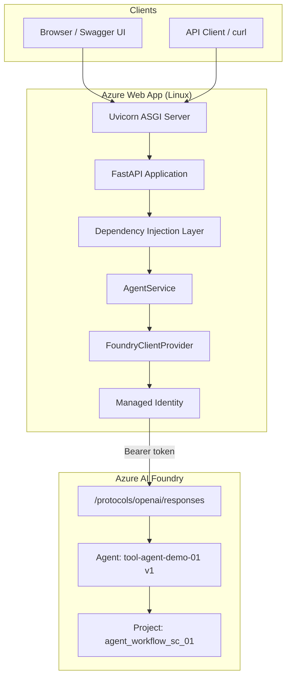
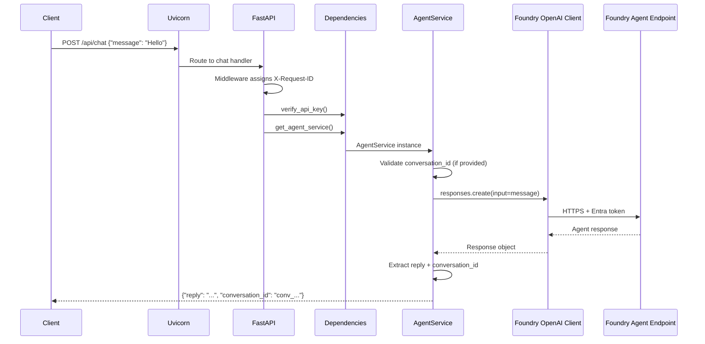
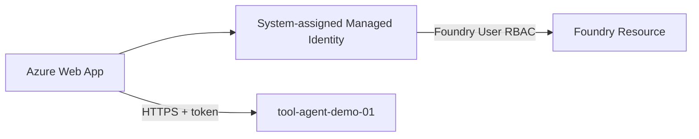

# Foundry Agent FastAPI Web App — Architecture & Setup Guide

This document describes the end-to-end architecture, request flow, configuration, and deployment steps for the FastAPI application that invokes an **Azure AI Foundry** agent from **Azure Web App**.

---

## 1. Overview

| Item | Value |
|------|--------|
| **Purpose** | Expose a REST API that forwards chat messages to a Foundry agent |
| **Runtime** | Python 3.12, FastAPI, Uvicorn |
| **Package manager** | [UV](https://docs.astral.sh/uv/) (local dev) |
| **Cloud host** | Azure Web App (Linux) |
| **Agent** | `tool-agent-demo-01` (Version 1) |
| **Protocol** | `responses` (OpenAI-compatible) |
| **Auth to Foundry** | Entra ID — Managed Identity (Azure) or `az login` (local) |

### High-level architecture



---

## 2. Design principles

1. **Async-first** — API routes and Foundry calls use `async`/`await`.
2. **Dependency injection** — FastAPI `Depends()` wires settings, services, and auth.
3. **No API keys for Foundry** — Authentication uses Azure RBAC + Entra ID tokens.
4. **Graceful startup** — If Foundry init fails, `/health` and `/docs` still work.
5. **Structured logging** — Request IDs, JSON logs in production, duration metrics.

---

## 3. Project structure

```text
fastapi-web-app/
├── app/
│   ├── main.py                 # App factory, lifespan, middleware, Swagger
│   ├── config.py               # Pydantic settings from environment
│   ├── dependencies.py         # FastAPI DI: auth, services
│   ├── logging_config.py       # JSON/text logging, request_id context
│   ├── routers/
│   │   ├── health.py           # GET /health
│   │   └── chat.py             # POST /api/chat, session endpoints
│   ├── schemas/
│   │   └── chat.py             # Request/response models
│   └── services/
│       ├── foundry_client.py   # AIProjectClient + AsyncOpenAI singleton
│       └── agent_service.py    # Agent invoke logic
├── startup.sh                  # Azure Web App startup script
├── requirements.txt            # Oryx/pip dependencies for Azure deploy
├── runtime.txt                 # python-3.12
├── pyproject.toml              # UV project definition
├── .env.example                # Local environment template
└── document.md                 # This file
```

---

## 4. Component responsibilities

### 4.1 `app/main.py`

- Creates the FastAPI application.
- Runs **lifespan** hooks: configure logging, initialize Foundry client.
- Registers HTTP middleware (request ID, timing).
- Mounts routers and enables Swagger at `/docs`.
- Redirects `/` → `/docs`.

### 4.2 `app/config.py`

Loads configuration from environment variables and `.env` (local only).

| Variable | Description |
|----------|-------------|
| `AZURE_AI_PROJECT_ENDPOINT` | Foundry project base URL |
| `AGENT_NAME` | Agent name (e.g. `tool-agent-demo-01`) |
| `AGENT_VERSION` | Agent version (e.g. `1`) — **not** `conversation_id` |
| `AGENT_PROTOCOL` | `responses` or `invocations` |
| `ENVIRONMENT` | `development` or `production` |
| `API_KEY` | Optional shared secret for `/api/*` routes |
| `LOG_LEVEL` | `INFO`, `DEBUG`, etc. |
| `LOG_JSON` | `true` for structured JSON logs in production |

Computed endpoint:

```text
{AZURE_AI_PROJECT_ENDPOINT}/agents/{AGENT_NAME}/endpoint/protocols/openai/responses?agent_version={AGENT_VERSION}
```

### 4.3 `app/dependencies.py`

FastAPI dependency injection:

| Dependency | Purpose |
|------------|---------|
| `get_settings()` | Cached `Settings` instance |
| `get_foundry_provider()` | Returns initialized `FoundryClientProvider` from `app.state` |
| `get_agent_service()` | Builds `AgentService` with settings + provider |
| `verify_api_key()` | Optional `X-API-Key` header check on `/api/*` |

### 4.4 `app/services/foundry_client.py`

- Creates async `AIProjectClient` with `allow_preview=True`.
- Obtains `AsyncOpenAI` client via `get_openai_client(agent_name=...)`.
- Selects credential by environment:

| Environment | Credential |
|-------------|------------|
| Azure Web App (`WEBSITE_SITE_NAME` set) | `ManagedIdentityCredential` |
| Local development | `DefaultAzureCredential` (`az login`) |

### 4.5 `app/services/agent_service.py`

- **`chat()`** — routes to responses or invocations protocol.
- **`_invoke_responses()`** — calls `responses_client.responses.create()`.
- Validates `conversation_id` (rejects values like `"1"`).
- Extracts `conversation_id` from `response.conversation.id` for multi-turn chat.

### 4.6 `app/logging_config.py`

- Text format for local dev.
- JSON format for production (`LOG_JSON=true`).
- Injects `request_id` into every log line via `ContextVar`.

---

## 5. Request flow (step by step)

### 5.1 Chat request flow



### 5.2 Step-by-step breakdown

1. **Client** sends `POST /api/chat` with JSON body.
2. **Middleware** assigns a unique `X-Request-ID` and logs request start.
3. **`verify_api_key`** checks optional `X-API-Key` header.
4. **`get_agent_service`** injects `AgentService` with Foundry client.
5. **`AgentService.chat()`** validates input and selects protocol.
6. **`FoundryClientProvider`** uses Managed Identity (Azure) to get a bearer token.
7. **OpenAI client** calls the agent responses endpoint with `agent_version` query param.
8. **Foundry agent** processes the message (tools, model, etc.).
9. **Response** is parsed; `conversation_id` is returned for follow-up turns.
10. **Middleware** logs completion time and returns response.

### 5.3 Multi-turn conversation

**First message** — omit `conversation_id`:

```json
{ "message": "Hello" }
```

**Follow-up** — use the id from the previous response:

```json
{
  "message": "Tell me more",
  "conversation_id": "conv_abc123..."
}
```

> **Important:** `AGENT_VERSION=1` is configured in App Settings. Do **not** put `1` in `conversation_id`.

---

## 6. API reference

| Method | Path | Auth | Description |
|--------|------|------|-------------|
| `GET` | `/` | None | Redirects to Swagger UI |
| `GET` | `/docs` | None | Swagger UI |
| `GET` | `/redoc` | None | ReDoc documentation |
| `GET` | `/openapi.json` | None | OpenAPI schema |
| `GET` | `/health` | None | Health check + Foundry readiness |
| `POST` | `/api/chat` | Optional API key | Send message to agent |
| `POST` | `/api/sessions` | Optional API key | Create hosted-agent session |
| `DELETE` | `/api/sessions/{id}` | Optional API key | Delete hosted-agent session |

### Example: chat request

```bash
curl -X POST https://<your-app>.azurewebsites.net/api/chat \
  -H "Content-Type: application/json" \
  -d '{"message": "Hello, what tools do you have?"}'
```

### Example: health check

```bash
curl https://<your-app>.azurewebsites.net/health
```

```json
{
  "status": "healthy",
  "foundry_ready": true
}
```

---

## 7. Authentication & RBAC

### 7.1 Local development

```bash
az login
```

Your user account needs **Foundry User** on the AI resource:

```bash
az role assignment create \
  --role "Foundry User" \
  --assignee "<your-email-or-object-id>" \
  --scope "/subscriptions/<sub-id>/resourceGroups/<rg>/providers/Microsoft.CognitiveServices/accounts/agent-workflow-sc-01-resource"
```

The app uses `DefaultAzureCredential`, which picks up your Azure CLI session.

### 7.2 Azure Web App (production)



**Steps:**

1. Enable **System-assigned managed identity** on the Web App.
2. Assign **Foundry User** role to the Web App identity on `agent-workflow-sc-01-resource`.
3. Set `ENVIRONMENT=production` in App Settings.
4. Restart the Web App.

**Do not** set `AZURE_CLIENT_ID` unless using a **user-assigned** managed identity.

### 7.3 Optional API protection

Set `API_KEY` in App Settings. Clients must send:

```http
X-API-Key: <your-secret>
```

---

## 8. Local development (step by step)

### Step 1 — Prerequisites

- Python 3.12
- [UV](https://docs.astral.sh/uv/) installed
- Azure CLI (`az`) logged in

### Step 2 — Configure environment

```bash
cp .env.example .env
```

Edit `.env` with your Foundry project and agent values.

### Step 3 — Install dependencies

```bash
uv sync
```

### Step 4 — Run the application

```bash
uv run uvicorn app.main:app --reload --port 8000
```

### Step 5 — Verify

| URL | Expected |
|-----|----------|
| http://localhost:8000/docs | Swagger UI |
| http://localhost:8000/health | `foundry_ready: true` |
| http://localhost:8000/api/chat | Agent reply |

---

## 9. Azure Web App deployment (step by step)

### Step 1 — Prepare the deployment package

Ensure these files are included in your deploy artifact:

- `app/` (application code)
- `requirements.txt`
- `runtime.txt` (`python-3.12`)
- `startup.sh`

Do **not** deploy `.venv/`, `.env`, or `app.zip` source duplicates.

Regenerate `requirements.txt` after dependency changes:

```bash
uv export --no-dev --no-hashes --no-emit-project -o requirements.txt
```

### Step 2 — Create or configure Web App

- **OS:** Linux
- **Runtime:** Python 3.12
- **Plan:** App Service plan (B1 or higher recommended)

### Step 3 — Deploy code

Options:

- ZIP deploy
- GitHub Actions
- Azure DevOps pipeline
- `az webapp deploy`

### Step 4 — Configure App Settings

| Name | Value |
|------|--------|
| `SCM_DO_BUILD_DURING_DEPLOYMENT` | `true` |
| `WEBSITES_PORT` | `8000` |
| `ENVIRONMENT` | `production` |
| `LOG_JSON` | `true` |
| `AZURE_AI_PROJECT_ENDPOINT` | `https://agent-workflow-sc-01-resource.services.ai.azure.com/api/projects/agent_workflow_sc_01` |
| `AGENT_NAME` | `tool-agent-demo-01` |
| `AGENT_VERSION` | `1` |
| `AGENT_PROTOCOL` | `responses` |

### Step 5 — Set startup command

**Configuration → General settings → Startup Command:**

```bash
bash startup.sh
```

Or inline:

```bash
python -m uvicorn app.main:app --host 0.0.0.0 --port 8000 --proxy-headers --forwarded-allow-ips="*"
```

`startup.sh` automatically uses Oryx's `antenv/bin/python` on Azure.

### Step 6 — Enable managed identity

1. Web App → **Identity** → System assigned → **On**
2. Copy the **Object (principal) ID**

### Step 7 — Assign RBAC

Grant **Foundry User** to the Web App identity on the Foundry resource (see Section 7.2).

### Step 8 — Restart and verify

```bash
az webapp restart --name <webapp-name> --resource-group <rg>
```

```bash
curl https://<your-app>.azurewebsites.net/health
curl https://<your-app>.azurewebsites.net/docs
```

---

## 10. Startup script explained

`startup.sh` performs these steps on Azure:

1. `cd` to `/home/site/wwwroot` (deployed app root).
2. Set `PYTHONPATH` so `app` module is importable.
3. Resolve Python from `antenv/bin/python` (Oryx virtualenv).
4. Read port from `WEBSITES_PORT` (default `8000`).
5. Start Uvicorn with proxy headers for Azure's load balancer.

---

## 11. Troubleshooting

### ManagedIdentityCredential — no response from IMDS

| Cause | Fix |
|-------|-----|
| Managed identity not enabled | Enable system-assigned identity on Web App |
| Wrong `AZURE_CLIENT_ID` | Remove it unless using user-assigned MI |
| App not restarted after RBAC | Restart Web App; wait 1–5 min for role propagation |

### 403 Forbidden from Foundry

| Cause | Fix |
|-------|-----|
| Missing RBAC | Assign **Foundry User** to Web App MI |
| Wrong scope | Assign role on the Cognitive Services / Foundry resource |

### Invalid conversation id `'1'`

| Cause | Fix |
|-------|-----|
| Sent `"conversation_id": "1"` in request body | Omit `conversation_id` for new chats |
| Confused with `AGENT_VERSION` | Version goes in App Settings, not request body |

### Application won't start on Azure

| Cause | Fix |
|-------|-----|
| `python` not on PATH | Use `bash startup.sh` (uses `antenv/bin/python`) |
| Missing `requirements.txt` | Deploy `requirements.txt`; set `SCM_DO_BUILD_DURING_DEPLOYMENT=true` |
| Missing `aiohttp` | Ensure `requirements.txt` includes `aiohttp` |
| Missing App Settings | Set `AZURE_AI_PROJECT_ENDPOINT`, `AGENT_NAME`, etc. |

### `foundry_ready: false` in `/health`

Check the `foundry_error` field in the health response. Common causes:

- Managed identity not configured
- RBAC not assigned
- Wrong project endpoint or agent name
- Missing `aiohttp` dependency

---

## 12. Environment comparison

| Aspect | Local (`development`) | Azure (`production`) |
|--------|----------------------|----------------------|
| Credential | `DefaultAzureCredential` | `ManagedIdentityCredential` |
| Auth source | `az login` | Web App managed identity |
| Config source | `.env` file | App Service App Settings |
| Logs | Text format | JSON format (`LOG_JSON=true`) |
| Server | `uv run uvicorn --reload` | `startup.sh` → Uvicorn |
| HTTPS | No | Yes (Azure front door) |

---

## 13. Security checklist

- [ ] Managed identity enabled on Web App
- [ ] **Foundry User** role assigned (least privilege)
- [ ] No secrets in source code or git
- [ ] `.env` not deployed to Azure (use App Settings)
- [ ] Optional `API_KEY` set for `/api/*` in production
- [ ] `LOG_JSON=true` for observability
- [ ] Agent tool connections (Search, Storage) have separate RBAC on agent MI if needed

---

## 14. Quick reference

**Foundry agent endpoint:**

```text
https://agent-workflow-sc-01-resource.services.ai.azure.com/api/projects/agent_workflow_sc_01/agents/tool-agent-demo-01/endpoint/protocols/openai/responses
```

**Swagger UI:**

```text
https://<your-app>.azurewebsites.net/docs
```

**Minimal chat payload:**

```json
{ "message": "Hello" }
```
